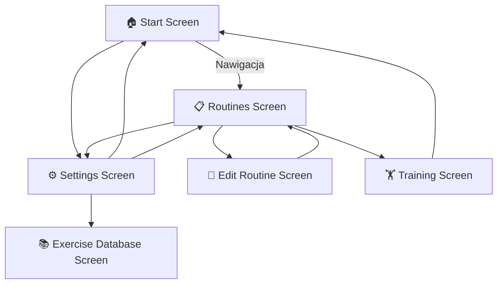

Nasza apka treningowa

Rami Matouk
Jan Galicki

## 🔀 Diagram nawigacji Colossus

```mermaid
graph TD
    StartScreen["🏠 Start Screen"]
    SettingsScreen["⚙️ Settings Screen"]
    RoutinesScreen["📋 Routines Screen"]
    EditRoutineScreen["📝 Edit Routine Screen"]
    TrainingScreen["🏋️ Training Screen"]
    ExerciseDatabaseScreen["📚 Exercise Database Screen"]

    StartScreen -->|Nawigacja| RoutinesScreen
    StartScreen --> SettingsScreen

    SettingsScreen --> ExerciseDatabaseScreen
    SettingsScreen --> StartScreen
    SettingsScreen --> RoutinesScreen

    RoutinesScreen --> EditRoutineScreen
    RoutinesScreen --> TrainingScreen
    RoutinesScreen --> SettingsScreen

    EditRoutineScreen --> RoutinesScreen

    TrainingScreen --> StartScreen
```
