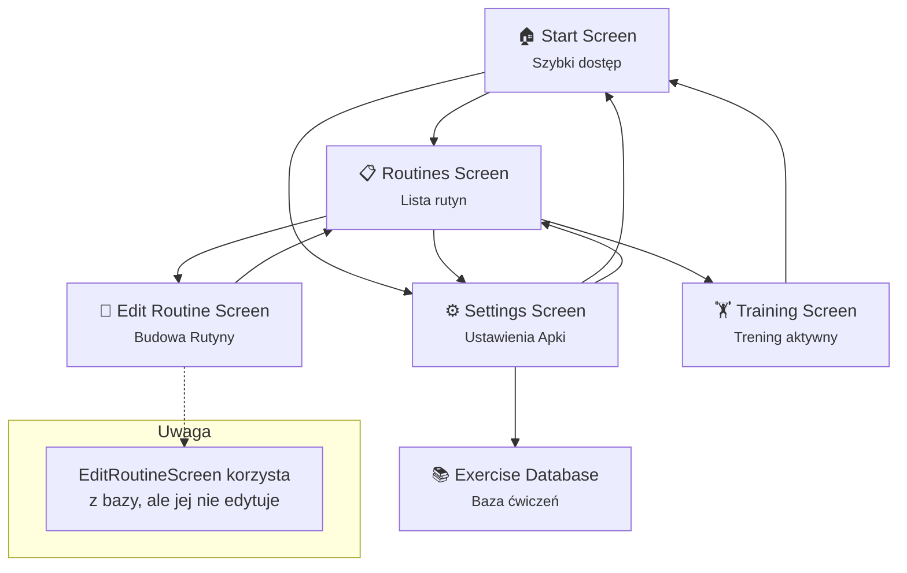

# 📱 Colossus – Gym Tracker App
Rami Matouk
Jan Galicki

**Colossus** to aplikacja mobilna do tworzenia, edytowania i śledzenia planów treningowych na siłowni.
Stworzona w **Jetpack Compose** + **Room Database** w języku **Kotlin**.

## Mockup aplikacji Colossus

https://www.figma.com/design/bDmddT8Lrk0nivnTjOQsMZ/GymApp?node-id=1-6&t=UbVZhWUv40pXeFEa-1


---

## ✨ Funkcje

* 🏠 **Start Screen** – szybki dostęp do ostatnich rutyn i zegara
* 📋 **Routines Screen** – przegląd, edycja, usuwanie i start rutyn
* 📝 **Edit Routine** – tworzenie i edytowanie planu (nazwa + lista ćwiczeń, serie, RPE, przerwy)
* ⚙️ **Settings** – ustawienia + dostęp do bazy ćwiczeń
* 📚 **Exercise Database** – dodawanie, usuwanie i edytowanie ćwiczeń
* 🏋️ **Training Screen** – ekran aktywnego treningu (docelowo z licznikiem czasu)

---

## 🧱 Architektura

* **Jetpack Compose** – UI
* **Room** – lokalna baza danych
* **ViewModel + State** – zarządzanie logiką i danymi
* **Nawigacja** – Compose Navigation z `NavHost`

---

## 📂 Struktura

```
com.example.gymapp/
├── data/
│   ├── model/              // Modele Room (Routine, Exercise, RoutineExercise)
│   ├── dao/                // DAO: RoutineDao, ExerciseDao, RoutineExerciseDao
│   └── db/                 // AppDatabase
├── ui/
│   ├── screens/            // Compose screeny: Start, Settings, Routine itd.
│   └── components/         // Reużywalne komponenty: RoutineCard, ExerciseItem
├── viewmodel/              // RoutineViewModel, ExerciseViewModel
└── navigation/             // NavGraph.kt
```

---

## 💾 Baza danych

* `Routine` – plan treningowy
* `Exercise` – ćwiczenie (nazwa, opis, media)
* `RoutineExercise` – połączenie rutyny z ćwiczeniem (serie, powtórzenia, RPE, przerwa)

---

## 🔄 Diagram nawigacji




