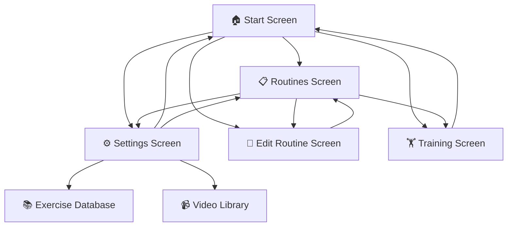

# 📱 Colossus – Gym Tracker App

Rami Matouk
Jan Galicki

**Colossus** to aplikacja mobilna do tworzenia, edytowania i śledzenia planów treningowych na siłowni.
Stworzona w **Jetpack Compose** + **Room Database** w języku **Kotlin**.

---

## 🎨 Mockup aplikacji Colossus

[🔗 Zobacz w Figma](https://www.figma.com/design/bDmddT8Lrk0nivnTjOQsMZ/GymApp?node-id=1-6&t=UbVZhWUv40pXeFEa-1)

---

## ✨ Funkcje

* 🏠 **Start Screen** – szybki dostęp do ostatnich rutyn i zegara
* 📋 **Routines Screen** – przegląd, edycja, usuwanie i start rutyn
* 📝 **Edit Routine** – tworzenie i edytowanie planu (nazwa + lista ćwiczeń, serie, RPE, przerwy)
* ⚙️ **Settings** – ustawienia + dostęp do bazy ćwiczeń
* 📚 **Exercise Database** – dodawanie, usuwanie i edytowanie ćwiczeń
* 📹 **Video Library** – ekran z filmami instruktażowymi do ćwiczeń
* 🏋️ **Training Screen** – aktywny trening z obsługą logów, serii i przerw

---

## 🧱 Architektura

* **Jetpack Compose** – nowoczesny UI
* **Room** – lokalna baza danych (SQLite)
* **ViewModel + State** – zarządzanie stanem aplikacji
* **Compose Navigation** – nawigacja z `NavHost` + argumenty

---

## 📂 Struktura projektu

```
com.example.gymapp/
├── data/
│   ├── model/              // Modele Room: Routine, Exercise, ExerciseLog, Tag
│   ├── dao/                // DAO: RoutineDao, ExerciseDao, RoutineExerciseDao, ExerciseLogDao
│   ├── db/                 // AppDatabase.kt
│   └── draft/              // Modele robocze (draft) np. RoutineExerciseDraft
├── ui/
│   ├── screens/            // Ekrany Compose: Start, Routines, Settings, Training, Exercises, VideoLibrary
│   └── components/         // Komponenty: RoutineCard, ExerciseItem, RestTimePickerDialog
├── viewmodel/              // ViewModele: RoutineViewModel, ExerciseViewModel
└── navigation/             // NavGraph.kt – definicja tras
```

---

## 💾 Model danych (Room)

* `Routine` – plan treningowy (id, nazwa, opis)
* `Exercise` – ćwiczenie (nazwa, opis, tagi, media)
* `RoutineExercise` – przypisanie ćwiczenia do rutyny (serie, RPE, przerwa)
* `ExerciseLog` – log wykonanych ćwiczeń (czas, serie, waga, powtórzenia)
* `Tag` – etykieta opisująca typ ćwiczenia (np. „push”, „legs”)

---

## 🔄 Diagram nawigacji



---

