Nasza apka treningowa

Rami Matouk
Jan Galicki

## Mockup aplikacji Colossus

https://www.figma.com/design/bDmddT8Lrk0nivnTjOQsMZ/GymApp?node-id=1-6&t=UbVZhWUv40pXeFEa-1

## 🔀 Diagram nawigacji Colossus

```mermaid
graph TD
    StartScreen["🠠Start Screen"]
    SettingsScreen["âš™ï¸ Settings Screen"]
    RoutinesScreen["📋 Routines Screen"]
    EditRoutineScreen["📠Edit Routine Screen"]
    TrainingScreen["ðŸ‹ï¸ Training Screen"]
    ExerciseDatabaseScreen["📚 Exercise Database Screen"]

    StartScreen -->|Nawigacja| RoutinesScreen
    StartScreen --> SettingsScreen

    SettingsScreen --> ExerciseDatabaseScreen
    SettingsScreen --> StartScreen
    SettingsScreen --> RoutinesScreen

    RoutinesScreen --> EditRoutineScreen
    RoutinesScreen --> TrainingScreen
    RoutinesScreen --> SettingsScreen

    EditRoutineScreen --> RoutinesScreen

    TrainingScreen --> StartScreen
```

